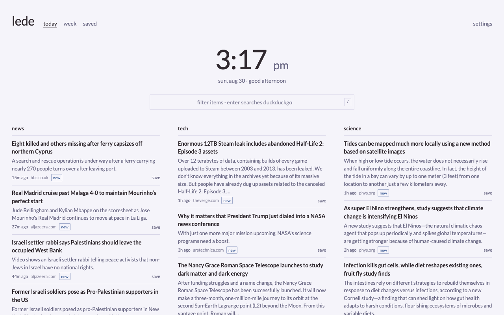
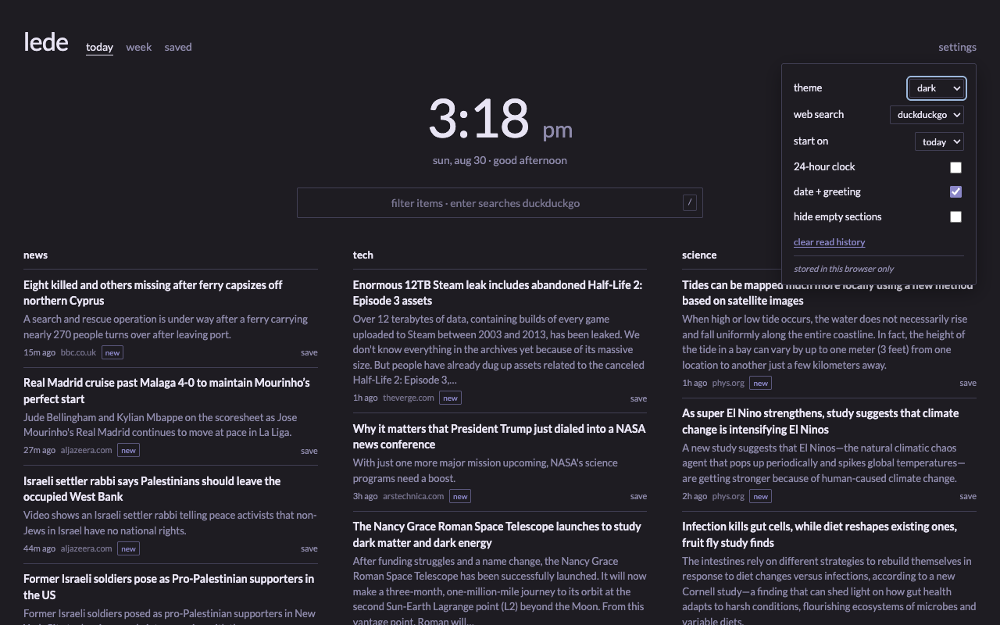
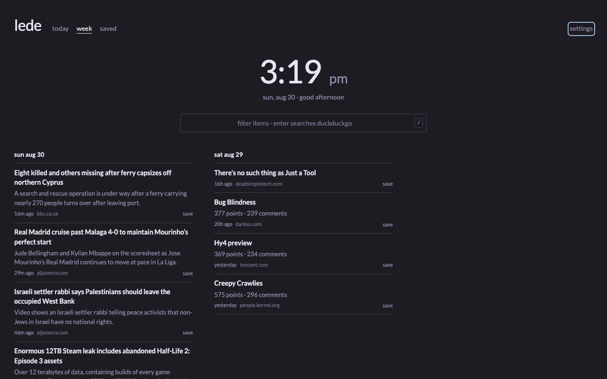
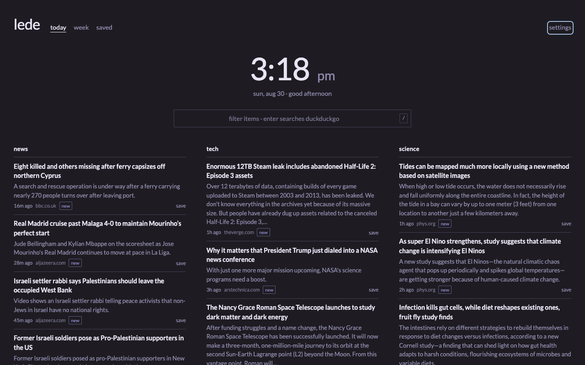
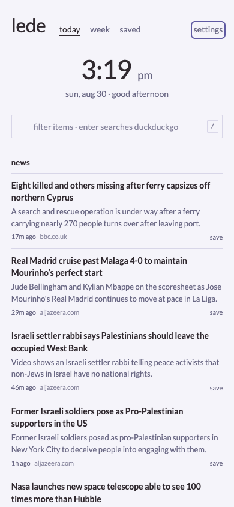

# lede

**A self-hosted daily news digest. Feeds in, one calm page out.**

[](https://github.com/ankitsxchdeva/lede/actions/workflows/backend.yml)
[](LICENSE)

lede pulls your RSS/Atom feeds (and a few genuinely feedless sites) into a
single "today" page: what your sources published since midnight, grouped into
sections you define, deduped across sources, with optional summaries from a
local LLM. No accounts, no tracking, no algorithmic feed — your sources,
newest first, rebuilt every 30 minutes.

It's built to be your **browser homepage**: a clock and web search up top,
your news below, settings that live in the browser. One container, or host
the frontend anywhere.



## Built to be your homepage

| | |
|---|---|
|  |  |

**Clock, date, and a quiet greeting** sit up top — the page you open fifty
times a day should tell you what time it is. **One search box does both
jobs**: typing filters the news below, Enter takes the query to your search
engine (DuckDuckGo, Google, Bing, Kagi, or Brave). The **settings panel**
covers theme (system/light/dark), 12/24-hour clock, default tab, empty
sections, and engine choice — all stored in the browser, never on your
server.

| | |
|---|---|
|  |  |

Dark mode follows your system or pins via settings; the whole thing collapses
to a single column on a phone.

## Features

- **Today board** — items grouped into sections; `category:` in `feeds.yaml`
  decides what exists and where it lands. New badges, read-state dimming, and
  `/` to filter.
- **Week archive** — the server keeps every digest item; the week view groups
  the last 7 days.
- **Saved list** — browser-local read-later list with CSV export. No server
  round-trips, no tokens.
- **Homepage furniture** — clock + date + greeting, dual-duty search box,
  theme override, all from the settings panel.
- **Dedup across sources** — the same story from an aggregator and its origin
  collapses to one entry (origin wins); other coverage appears as "also:"
  links.
- **Optional LLM summaries** — a local [Ollama](https://ollama.com) rewrites
  each item's blurb and writes a short "today's themes" intro. Off by default;
  degrades gracefully when the model is unreachable.
- **Feedless sites** — drop a small Python module in `backend/scrapers/`.
- **Failure-tolerant** — a dead feed keeps its last good items and a small
  "unreachable" note; it never blanks the page or fails the build.

## Quickstart

You need Docker with the compose plugin. Three commands:

```bash
git clone https://github.com/ankitsxchdeva/lede.git && cd lede
cp feeds.example.yaml feeds.yaml && cp .env.example .env
docker compose up -d
```

Open **http://localhost:8000**. The first digest takes about a minute (watch
`docker compose logs -f lede`); the page fills in as soon as `data.json`
exists. The container serves the frontend and API on the same port — no
separate hosting, no CORS.

Make it yours: edit `feeds.yaml` (see below), then
`docker compose restart lede`. Everything else is optional.

## Optional: LLM summaries

lede can rewrite each item's summary with a local model — useful for feeds
whose blurbs are teasers or navigation junk. Off by default; with it off,
items show their feed's own truncated blurb and everything still works.

```bash
docker compose --profile llm up -d          # adds an Ollama service
docker exec lede-ollama ollama pull qwen3:8b
# in .env: SUMMARY_ENABLED=1
docker compose restart lede
```

Already running Ollama somewhere (another box, a GPU host)? Skip the profile
and point `OLLAMA_URL` at it in `.env`. Summaries are cached in SQLite, so
each item hits the model exactly once, and a per-cycle budget plus a circuit
breaker keep a slow or dead Ollama from ever delaying the digest.

## Configuration

All of it is optional; `feeds.yaml` + `.env` defaults are a working install.

### `.env`

| variable | default | what it does |
|---|---|---|
| `POLL_INTERVAL_SECONDS` | `1800` | how often the digest rebuilds |
| `DIGEST_TZ` | `UTC` | midnight boundary for "today" (IANA name) |
| `ALLOW_ORIGIN` | `*` | CORS origin for the API — set to your frontend's origin if hosted separately |
| `USER_AGENT` | `lede/1.0` | fetch identification; a contact URL is polite |
| `PAYWALL_PROXY` | — | route `paywall: true` sources through a 13ft proxy |
| `TZ` | `UTC` | log timestamps |
| `SUMMARY_ENABLED` | `1` in code, `0` in `.env.example` | master switch for LLM summaries |
| `OLLAMA_URL` | `http://ollama:11434` | any reachable Ollama |
| `OLLAMA_MODEL` | — | model for summaries + themes |
| `OLLAMA_TIMEOUT` | `90` | per-call timeout (seconds) |
| `OLLAMA_KEEP_ALIVE` | `10m` | how long the model stays resident |
| `SUMMARY_MAX_PER_CYCLE` | `50` | model-call budget per build cycle |
| `SUMMARY_BREAKER_THRESHOLD` | `3` | consecutive failures before falling back for the cycle |
| `STATIC_DIR` | auto-detected | override where the frontend is served from |

### `feeds.yaml`

One file, one list. A source needs a `name`, a `url`, and a `category` (the
page section — free-form, one word per section). If the URL isn't a feed,
lede looks for one (`<link rel="alternate">`, `/feed`, `/rss`...).

```yaml
  - name: Hacker News
    url: https://hn.algolia.com/api/v1/search?tags=front_page&hitsPerPage=30
    scrape: hackernews        # feedless sites get a backend/scrapers/ module
    category: tech
    tags: [hn]                # searchable in the frontend
    limit: 10                 # cap items per cycle
    aggregator: true          # links out; origin feeds win duplicates
    min_today: 8              # top up quiet mornings from yesterday
    # paywall: true           # fetch through PAYWALL_PROXY
```

Only items published since midnight (`DIGEST_TZ`) make the board, except
`min_today` backfill. After editing, `docker compose restart lede` rebinds
the file and rebuilds immediately.

## Hosting the frontend somewhere else

The container serving both halves is the default, but the frontend is three
static files — host it on GitHub Pages, Netlify, anywhere:

1. Set `<meta name="lede:api" content="https://your-api-host">` in `index.html`.
2. Set `ALLOW_ORIGIN` to your frontend's origin in `.env`.
3. Optionally pin section order with
   `<meta name="lede:sections" content="news, tech, science">`
   (without it, sections follow whatever categories your `feeds.yaml` uses).

One gotcha: if the API hostname resolves to a private/CGNAT address (e.g. a
Tailscale funnel IP), Chrome's Private Network Access may block a *public*
page from fetching it. Either host the API on a normal public hostname or
have visitors allow the browser prompt.

## Updating

```bash
docker compose pull && docker compose up -d
```

Or run [watchtower](https://github.com/containrrr/watchtower) to pull new
images automatically.

## Local dev

```bash
cd backend
pip install -r requirements.txt
cp ../feeds.example.yaml feeds.yaml
SUMMARY_ENABLED=0 python app.py    # API + frontend on :8000, no Docker needed
python test_cluster.py             # the tests
```

Frontend-only work: `python3 -m http.server 8080` from the repo root — on
localhost, `reader.js` targets `localhost:8000` automatically.

## Project layout

```
index.html reader.js reader.css fonts/   # the whole frontend — no build step
feeds.example.yaml  .env.example         # copy these; the copies are gitignored
docker-compose.yml                       # the quickstart
docs/                                    # README screenshots
PRODUCT.md DESIGN.md                     # design context for AI tooling (impeccable)
backend/                                 # the digest app (see backend/README.md)
  app.py           # build loop + FastAPI server
  fetch.py         # feed fetching, discovery, normalization
  cluster.py       # cross-source dedup
  summarize.py     # optional Ollama enrichment (cache, budget, breaker)
  extract.py       # full article text for the summarizer
  db.py            # SQLite: summary cache + week archive
  scrapers/        # feedless-site modules (hackernews, yahoo_finance_ai)
  Dockerfile       # multi-arch image: app + frontend, one container
```

## Contributing

Small project, small PRs — see [CONTRIBUTING.md](CONTRIBUTING.md). Bugs and
ideas go in [issues](https://github.com/ankitsxchdeva/lede/issues).

## License

[MIT](LICENSE).
